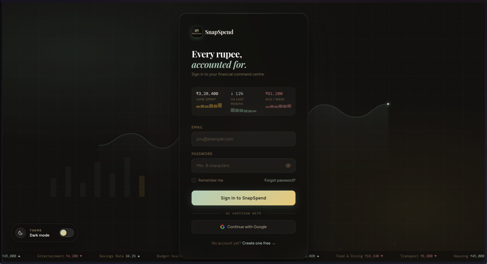
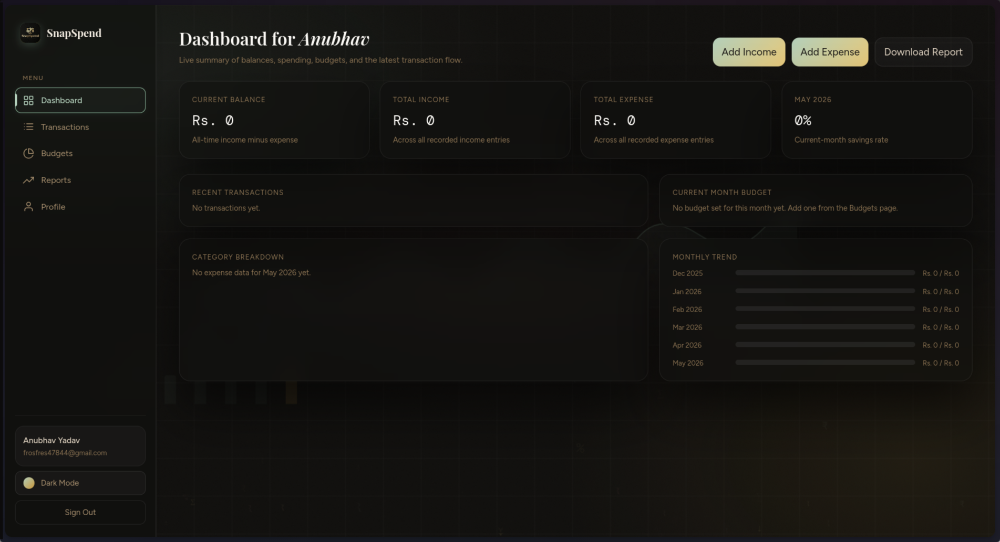
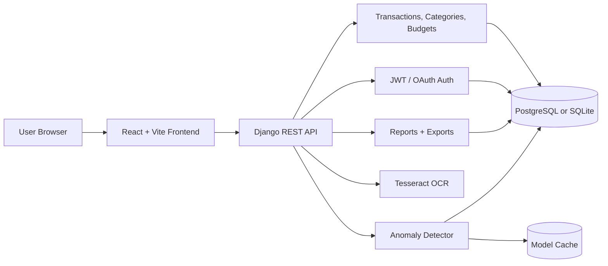
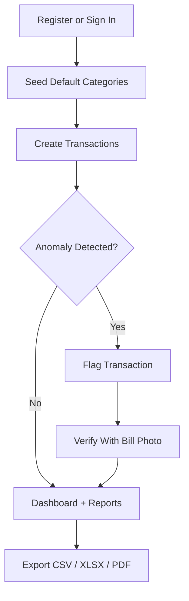

# SnapSpend

SnapSpend is a full-stack personal finance tracker for recording income, managing expenses, monitoring monthly budgets, exporting reports, and spotting unusual spending with ML-assisted anomaly detection. It combines a React/Vite frontend with a Django REST API, JWT authentication, PostgreSQL or SQLite storage, OCR-based bill scanning, and export-ready reporting.

## Features

- JWT authentication with registration, login, refresh tokens, logout, profile updates, password changes, and optional Google/Firebase or Apple OAuth configuration.
- Transaction and category management for income and expenses, including custom user categories and system default categories.
- Search, filtering, sorting, date range views, and current-month transaction workflows.
- Monthly budget tracking with spent, remaining, progress, near-limit, and exceeded states.
- Dashboard analytics for balance, income, expenses, recent activity, category breakdowns, and trend data.
- ML-powered anomaly detection using Isolation Forest with a statistical fallback for small transaction histories.
- OCR bill scanning and bill-photo verification for flagged transactions.
- CSV, Excel, and PDF exports for reports.
- Frontend-only demo mode backed by browser storage for quick UI exploration.

## Screenshots and GIFs

Store product screenshots or walkthrough GIFs under `docs/assets/screenshots/`.

| View | Preview |
| --- | --- |
| Sign in |  |
| Dashboard |  |

Suggested future captures: transaction filters, budget progress, bill scan flow, anomaly verification, and export menu.

## Architecture





## Tech Stack

| Layer | Technology |
| --- | --- |
| Frontend | React 19, Vite, React Router, Axios, Recharts, Tailwind CSS |
| Backend | Python, Django 5.2, Django REST Framework, SimpleJWT |
| Database | PostgreSQL for production, SQLite for local development/testing |
| ML | scikit-learn Isolation Forest, pandas, NumPy, joblib |
| OCR | Tesseract OCR, Pillow |
| Reports | CSV, openpyxl, reportlab |
| Deployment | Gunicorn, WhiteNoise, Render-compatible backend config, Vercel frontend config |

## Project Structure

```text
expense-tracker/
├── backend/
│   ├── apps/
│   │   ├── accounts/        # User auth, JWT, OAuth, profile
│   │   ├── budgets/         # Monthly budgets
│   │   ├── reports/         # Dashboard data and exports
│   │   └── transactions/    # Transactions, categories, OCR, verification
│   ├── config/              # Django settings, URLs, ASGI/WSGI
│   ├── ml/                  # ML preprocessing and anomaly detection
│   └── requirements.txt
├── database/                # Schema notes, seeds, deployment, QA docs
├── dataset/                 # Income/expense dataset and processed splits
├── frontend/
│   ├── public/              # Branding and static assets
│   └── src/                 # Pages, components, context, services, utils
├── CONTRIBUTING.md
├── CODE_OF_CONDUCT.md
├── LICENSE
├── SECURITY.md
└── README.md
```

## Setup

### Prerequisites

- Python 3.11+
- Node.js 18+ and npm
- PostgreSQL for production-style local development, or SQLite for the quickest setup
- Tesseract OCR for bill scanning and verification

Install Tesseract on Ubuntu/Debian:

```bash
sudo apt install tesseract-ocr
```

### 1. Clone

```bash
git clone <repository-url>
cd expense-tracker
```

### 2. Backend

```bash
cd backend
python -m venv .venv
source .venv/bin/activate
pip install -r requirements.txt
cp .env.example .env
```

For the fastest local setup, keep SQLite enabled in `backend/.env`:

```env
DATABASE_ENGINE=sqlite
SQLITE_NAME=db.sqlite3
DEBUG=True
FRONTEND_URL=http://localhost:5173
FRONTEND_URLS=http://localhost:5173
```

For PostgreSQL, set:

```env
DATABASE_ENGINE=postgres
POSTGRES_DB=expense_tracker
POSTGRES_USER=postgres
POSTGRES_PASSWORD=your_password
POSTGRES_HOST=localhost
POSTGRES_PORT=5432
```

Then initialize and run the API:

```bash
python manage.py migrate
python manage.py seed_categories
python manage.py runserver
```

Backend URL: `http://localhost:8000`

### 3. Frontend

In a second terminal:

```bash
cd frontend
npm install
cp .env.example .env
npm run dev
```

Frontend URL: `http://localhost:5173`

The frontend API base is configured with:

```env
VITE_API_BASE_URL=http://127.0.0.1:8000
```

### 4. Frontend-Only Demo Mode

To explore the UI without a running backend, set this in `frontend/.env`:

```env
VITE_FRONTEND_ONLY=true
```

ML anomaly detection, OCR, bill verification, authenticated API flows, and server exports require the Django backend.

## Environment Variables

### Backend (`backend/.env`)

| Variable | Purpose |
| --- | --- |
| `SECRET_KEY` | Django secret key. Change before production. |
| `DEBUG` | Enables local debug behavior when `True`. |
| `ALLOWED_HOSTS` | Comma-separated allowed hosts. |
| `DATABASE_URL` | Full database connection string. Overrides split database variables. |
| `DATABASE_ENGINE` | `sqlite` or `postgres`. |
| `SQLITE_NAME` | SQLite database filename. |
| `POSTGRES_*` | PostgreSQL database connection settings. |
| `FRONTEND_URL`, `FRONTEND_URLS` | Frontend origins for CORS/CSRF. |
| `GOOGLE_OAUTH_*`, `FIREBASE_*`, `APPLE_OAUTH_*` | Optional social sign-in configuration. |
| `ML_ANOMALY_*` | Optional anomaly detector tuning and cache settings. |
| `SECURE_*`, `SESSION_COOKIE_*`, `CSRF_COOKIE_*` | Production security controls. |

### Frontend (`frontend/.env`)

| Variable | Purpose |
| --- | --- |
| `VITE_API_BASE_URL` | Backend host, normalized by the app to include `/api`. |
| `VITE_FRONTEND_ONLY` | Enables local browser-storage demo mode. |
| `VITE_FIREBASE_*` | Optional Firebase web app configuration. |

## API Overview

| Area | Endpoints |
| --- | --- |
| Health | `GET /health/` |
| Auth | `POST /api/auth/register/`, `POST /api/auth/login/`, `POST /api/auth/refresh/`, `GET /api/auth/me/`, `PUT /api/auth/me/`, `POST /api/auth/logout/` |
| Transactions | `GET/POST /api/transactions/`, `GET/PUT/DELETE /api/transactions/{id}/` |
| Categories | `GET/POST /api/categories/`, `PUT/DELETE /api/categories/{id}/` |
| Budgets | `GET/POST /api/budgets/`, `PUT /api/budgets/{id}/` |
| ML and OCR | `GET /api/transactions/anomalies/`, `POST /api/transactions/verify/`, `POST /api/transactions/scan-bill/` |
| Reports | `GET /api/reports/dashboard/`, `GET /api/reports/monthly/`, `GET /api/reports/category-summary/`, `GET /api/reports/export/csv/`, `GET /api/reports/export/xlsx/`, `GET /api/reports/export/pdf/` |

## Testing

Backend:

```bash
cd backend
source .venv/bin/activate
python manage.py test
```

Frontend:

```bash
cd frontend
npm run build
```

## Deployment

- Backend: see [database/deployment.md](database/deployment.md) for Render/PaaS-oriented deployment notes.
- Frontend: deploy `frontend/` to Vercel or another static host and set `VITE_API_BASE_URL` to the backend host.
- Database: use PostgreSQL in production, preferably through `DATABASE_URL` with SSL enabled.
- Security: set a strong `SECRET_KEY`, disable debug mode, configure trusted frontend origins, and review [SECURITY.md](SECURITY.md).

## Future Roadmap

- Add real-time budget notifications and recurring transaction reminders.
- Add richer forecasting for monthly spend and cash flow.
- Improve anomaly explainability with clearer user-facing reasons and confidence bands.
- Add multi-currency support and exchange-rate normalization.
- Add receipt storage integrations for S3-compatible object storage.
- Add shared household budgets and role-based collaboration.
- Add automated E2E tests for core finance workflows.
- Publish polished screenshots and walkthrough GIFs in `docs/assets/screenshots/`.

## Contributing

Contributions are welcome. Start with [CONTRIBUTING.md](CONTRIBUTING.md), follow the [CODE_OF_CONDUCT.md](CODE_OF_CONDUCT.md), and report vulnerabilities through [SECURITY.md](SECURITY.md).

## License

This project is licensed under the MIT License. See [LICENSE](LICENSE).
